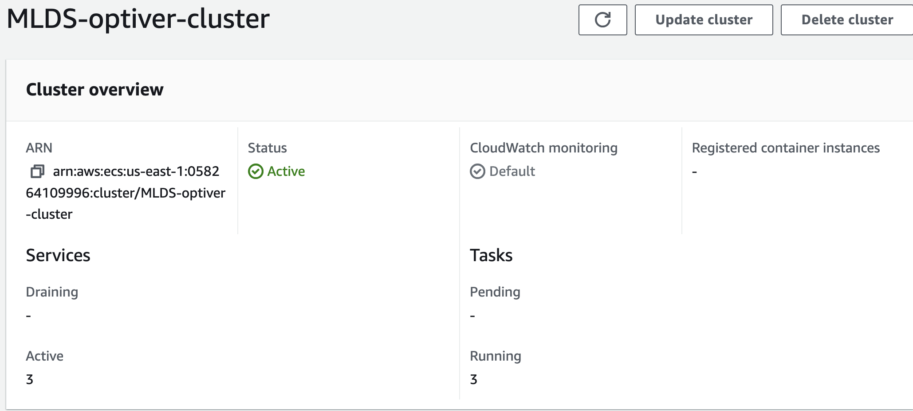
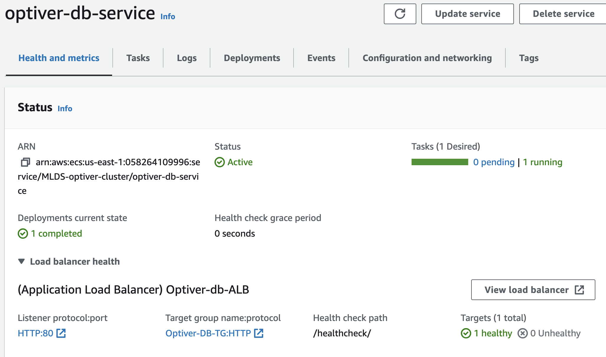
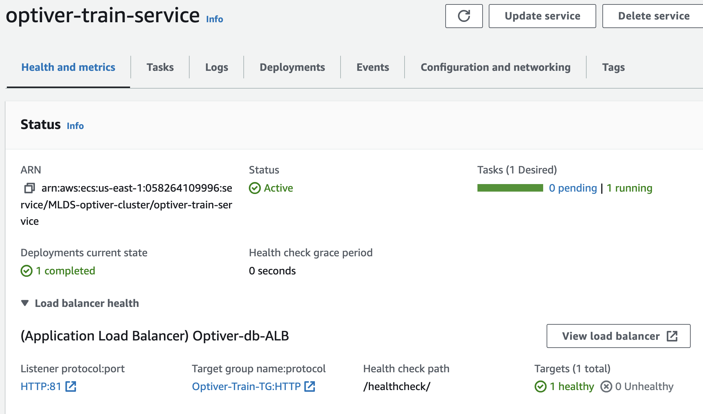
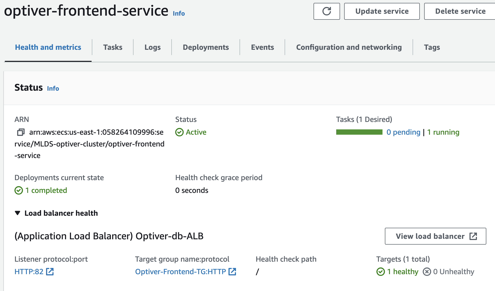
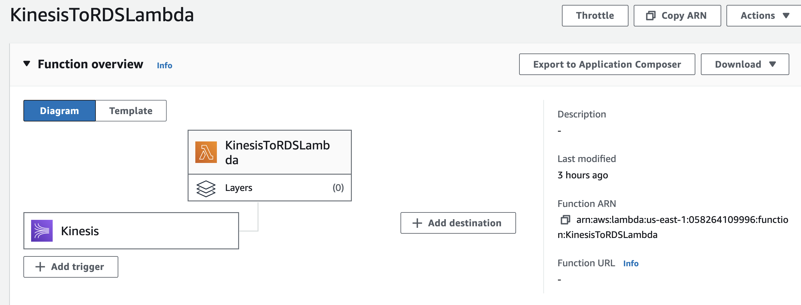
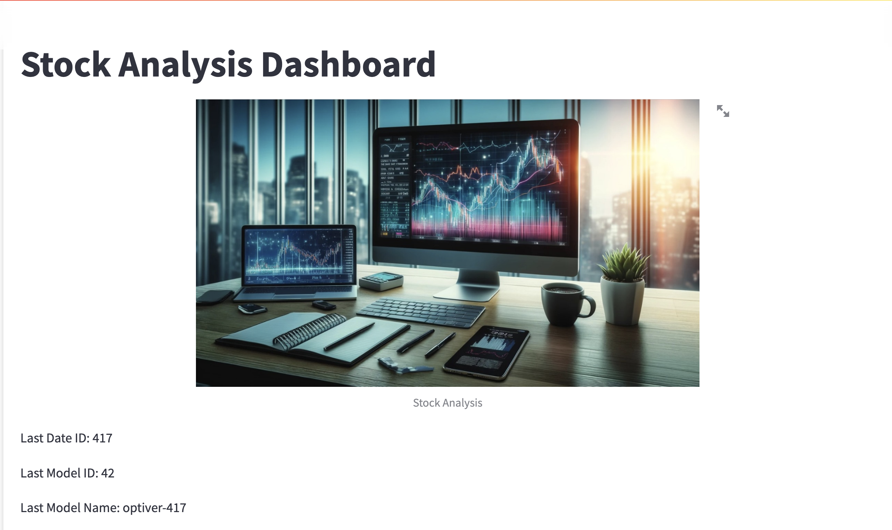
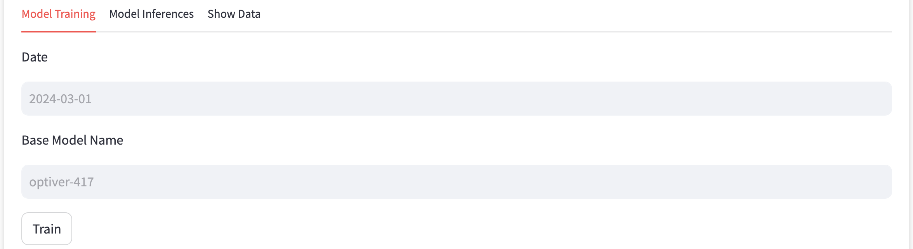
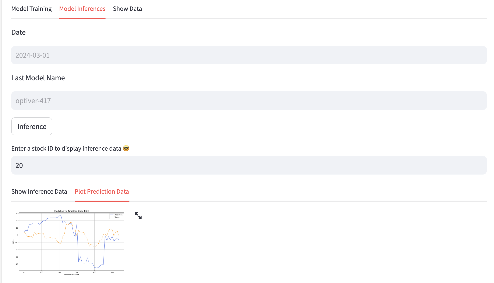

# Optiver Trading App

## Introduction

The Optiver Trading App is designed to predict closing price movements of Nasdaq-listed stocks using order book data and various machine learning techniques. The project utilizes cloud engineering principles to ensure scalability, flexibility, and real-time processing, making it suitable for high-stakes environments where accurate price predictions are critical.

---

## Table of Contents

1. [Introduction](#introduction)
2. [Features](#features)
3. [Components](#components)
   - [Optiver App](#optiver-app)
   - [Train App](#train-app)
   - [Frontend](#frontend)
   - [Data Streaming](#data-streaming)
4. [Examples](#examples)
5. [Contributors](#contributors)
---

## Features

- **Real-Time Data Processing:** Utilizes AWS Kinesis Data Streams and Lambda for real-time data ingestion and processing.
- **Scalability:** Easily handles large datasets with the ability to scale resources up or down.
- **Machine Learning:** Implements XGBoost for incremental training and prediction.
- **Flexible Cloud Architecture:** Integrates various AWS services (ECS, RDS, S3) for a robust infrastructure.
- **Web Interface:** Provides a user-friendly interface for interacting with the application and visualizing performance.
---
## Components

### Optiver App

The Optiver App is the core component responsible for processing real-time data and making predictions based on the trained machine learning models. 
- For detailed documentation, refer to the [Optiver App Documentation](docs/optiver_app.md).
- For detailed API Reference, refer to the [Optiver DB APIs Documentation](docs/db-apis.md).

### Train App

The Train App handles the training of machine learning models using historical order book data. It ensures the models are up-to-date and accurate. 
- For detailed documentation, refer to the [Train App Documentation](docs/train_app.md).
- For detailed API Reference, refer to the [Train-Inference APIs Documentation](docs/train-apis.md)

### Frontend

The Frontend provides a web interface for users to interact with the system, visualize data, and view predictions. For detailed documentation, refer to the [Frontend Documentation](docs/frontend.md).

### Data Streaming

The Data Streaming component is responsible for real-time data ingestion using AWS Kinesis Data Streams. It ensures that live market data is continuously fed into the system for processing and analysis. For detailed documentation, refer to the [Data Streaming Documentation](docs/data_streaming.md)

---

## Examples

### Deployed Services

#### ECS Cluster

#### Optiver DB Service

#### Optiver Train Service

#### Optiver Frontend Service

#### Lambda Trigger

# Web UI 

# Contributors
- Ayush Agarwal
- Kevin Li
- Kexian Wu
- Mark Li
